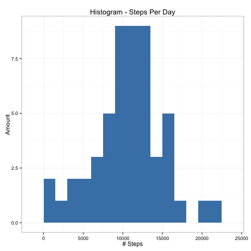
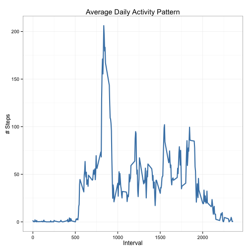

# Reproducible Research: Peer Assessment 1

It is now possible to collect a large amount of data about personal movement using activity monitoring devices such as a Fitbit, Nike Fuelband, or Jawbone Up. These type of devices are part of the “quantified self” movement – a group of enthusiasts who take measurements about themselves regularly to improve their health, to find patterns in their behavior, or because they are tech geeks. But these data remain under-utilized both because the raw data are hard to obtain and there is a lack of statistical methods and software for processing and interpreting the data.

This assignment makes use of data from a personal activity monitoring device. This device collects data at 5 minute intervals through out the day. The data consists of two months of data from an anonymous individual collected during the months of October and November, 2012 and include the number of steps taken in 5 minute intervals each day.

## Loading and preprocessing the data

Data is read into data frame from CSV and interval column is changed to type factor and date column to type Date.


```r
library(ggplot2)

readTransformData <- function() {
    unzipped <- unz("activity.zip", "activity.csv")
    df <- read.csv(unzipped, colClasses = c("numeric", "character", "numeric"), 
        header = T)
    df$interval <- factor(df$interval)
    df$date <- as.Date(df$date, format = "%Y-%m-%d")
    df
}
df <- readTransformData()
```


## What is mean total number of steps taken per day?

Histogram of daily total steps taken with the mean and median total number of steps per day.


```r
plotSteps <- function(df) {
    
    ## Plot steps data
    ggplot(steps, aes(x = steps)) + geom_histogram(fill = "steelblue", binwidth = 1500) + 
        labs(title = "Histogram - Steps Per Day", x = "# Steps", y = "Amount") + 
        theme_bw()
}
## Format data and find necessary values
steps <- aggregate(steps ~ date, df, sum)
colnames(steps) <- c("date", "steps")
meanS = round(mean(steps$steps), 2)
medianS = round(median(steps$steps), 2)

## Plot data
plotSteps(df)
```

 


**Mean and Median for Total Steps/Day:**  
- Mean:  10766.19
- Median:  10765

## What is the average daily activity pattern?

A plot of the average daily activity pattern of the 5 minute inverval and average number of steps taken (averaged across all days) is below.


```r
plotActivity <- function(df, SPI) {
    
    ggplot(SPI, aes(x = interval, y = steps)) + geom_line(color = "steelblue", 
        size = 1) + labs(title = "Average Daily Activity Pattern", x = "Interval", 
        y = "# Steps") + theme_bw()
}


SPI <- aggregate(df$steps, by = list(interval = df$interval), na.rm = T, FUN = mean)
SPI$interval <- as.integer(levels(SPI$interval)[SPI$interval])
colnames(SPI) <- c("interval", "steps")
maxSI <- SPI[which.max(SPI$steps), ]$interval
plotActivity(df, SPI)
```

 


**5 Minute Interval w/ Maximum Number of Steps:**  
- Interval: 835

## Imputing missing values

Calculate and report the total number of missing values in the dataset.


```r
sum(is.na(df))
```

```
## [1] 2304
```


Missing values are replaced with the mean value at the same interval. A new data frame with NAs filled will be created.


```r
dfNew <- merge(df, SPI, by = "interval", suffixes = c("", ".y"))
dfNA <- is.na(df$steps)
dfNew$steps[dfNA] <- dfNew$steps.y[dfNA]
dfNew <- dfNew[, c(1:3)]
```


With the imputed dataset, below is a histogram of the daily total number of steps taken, plotted with a bin interval of 1500 steps. Also marked on the plot are the mean and median of the daily total steps.


```r
SPD <- aggregate(steps ~ date, dfNew, sum)
colnames(SPD) <- c("date", "steps")

## Format data and find necessary values
steps <- aggregate(steps ~ date, df, sum)
colnames(steps) <- c("date", "steps")
filledMeanS = round(mean(SPD$steps), 2)
filledMedianS = round(median(SPD$steps), 2)

## Plot
plotSteps(dfNew)
```

 


**Mean and Median for Total Steps/Day:**  
- Mean:  9440.51
- Median:  10430.55

The mean and median values dropped after filling in the NA values.

## Are there differences in activity patterns between weekdays and weekends?

Created a new factor variable in the dataset with two levels: “weekday” and “weekend”.


```r
typeDay <- function(date) {
    if (weekdays(as.Date(date)) %in% c("Saturday", "Sunday")) {
        "weekend"
    } else {
        "weekday"
    }
}
dfNew$typeDay <- as.factor(sapply(dfNew$date, typeDay))
```


A panel plot containing a time series plot of the 5-minute interval and the average number of steps taken (averaged across all weekend or week day days) is below.


```r
par(mfrow = c(2, 1))
for (type in c("weekend", "weekday")) {
    steps.type <- aggregate(steps ~ interval, data = dfNew, subset = dfNew$typeDay == 
        type, FUN = mean)
    plot(steps.type, type = "L", main = type)
}
```

 


A pattern difference between weekdays and weekends is that on weekends the activity is more spread out across the day where during weekdays they occure more along certain times.
